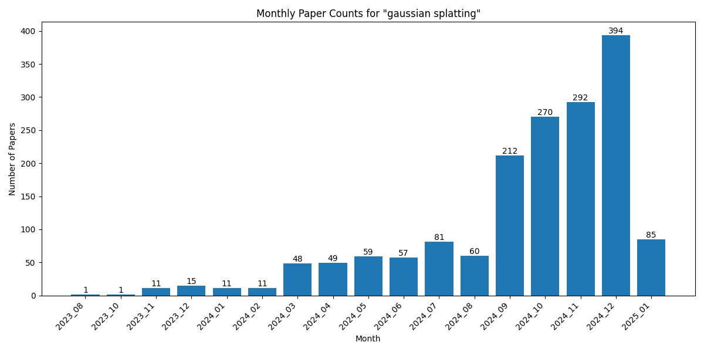

# Statistics for gaussian splatting

## Overall Statistics

- Total number of papers: 1657
- Number of months tracked: 17
- Average papers per month: 97.5

## Monthly Trends

## Monthly Breakdown

| Month | Paper Count | Percentage of Total |
| --- | --- | --- |
| 2025_01 | 85 | 5.1% |
| 2024_12 | 394 | 23.8% |
| 2024_11 | 292 | 17.6% |
| 2024_10 | 270 | 16.3% |
| 2024_09 | 212 | 12.8% |
| 2024_08 | 60 | 3.6% |
| 2024_07 | 81 | 4.9% |
| 2024_06 | 57 | 3.4% |
| 2024_05 | 59 | 3.6% |
| 2024_04 | 49 | 3.0% |
| 2024_03 | 48 | 2.9% |
| 2024_02 | 11 | 0.7% |
| 2024_01 | 11 | 0.7% |
| 2023_12 | 15 | 0.9% |
| 2023_11 | 11 | 0.7% |
| 2023_10 | 1 | 0.1% |
| 2023_08 | 1 | 0.1% |
