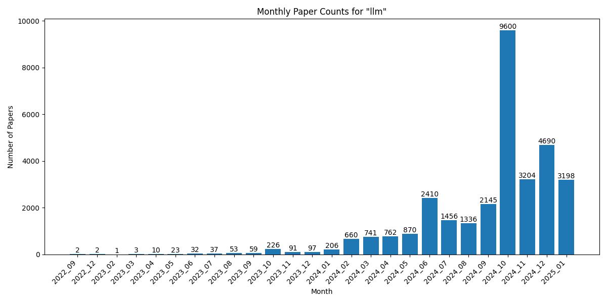

# Statistics for llm

## Overall Statistics

- Total number of papers: 11829
- Number of months tracked: 4
- Average papers per month: 2957.2

## Monthly Trends

## Monthly Breakdown

| Month | Paper Count | Percentage of Total |
| --- | --- | --- |
| 2025_01 | 3168 | 26.8% |
| 2024_12 | 4683 | 39.6% |
| 2024_11 | 3204 | 27.1% |
| 2024_10 | 774 | 6.5% |
